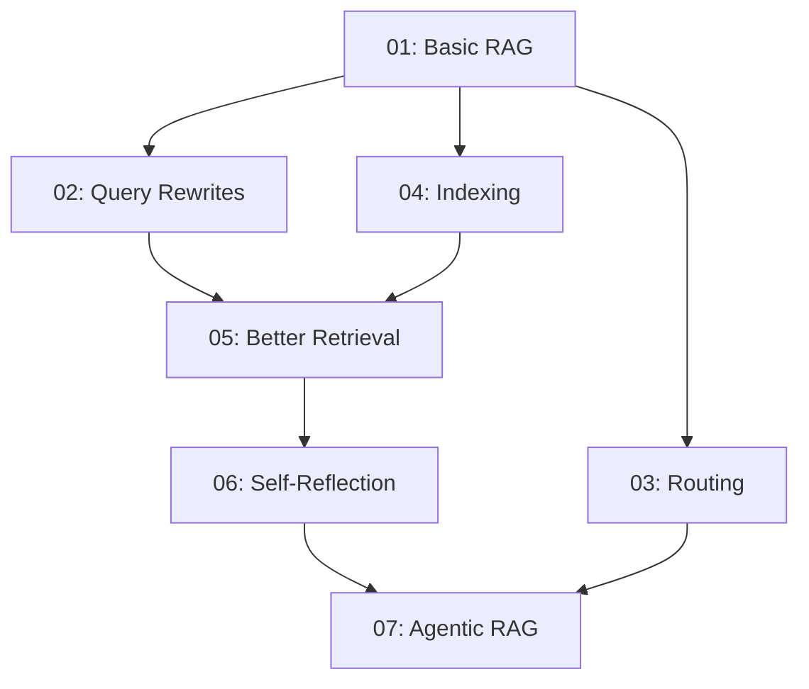
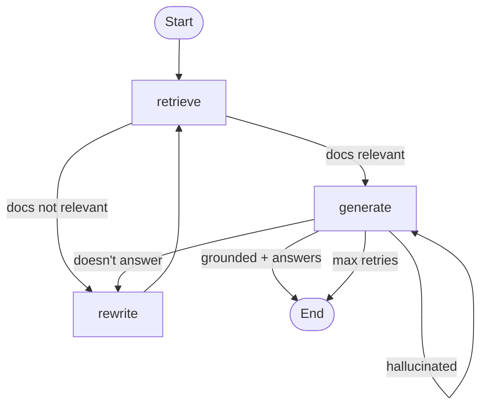

<div align="center">

# rag-from-scratch-to-agentic

**A progressive, script-based journey through Retrieval-Augmented Generation — from the simplest pipeline to a self-reflecting agent. Free-tier stack, zero local model downloads.**

[](https://github.com/your-username/rag-from-scratch-to-agentic/actions/workflows/ci.yml)
[](https://www.python.org/downloads/)
[](LICENSE)
[](https://github.com/astral-sh/ruff)

[Quick Start](#quick-start) · [The Journey](#the-journey) · [Tech Stack](#the-free-stack) · [Usage](#usage) · [Roadmap](#roadmap)

</div>

---

## Why this project?

Most RAG tutorials either stop at "vector search + prompt" or jump straight into a 500-line LangGraph demo. This repo walks the **middle path** — seven progressive scripts that build on each other, each adding exactly one technique:

- **Scripts, not notebooks** — production-shaped code you can read, debug, and deploy
- **Free-tier stack** — runs on Groq + HuggingFace + LangSmith free tiers, no credit card
- **Self-contained** — `pip install -e .`, set three keys, run
- **Observable** — every run traced in LangSmith

## TL;DR

```bash
git clone https://github.com/your-username/rag-from-scratch-to-agentic.git
cd rag-from-scratch-to-agentic
pip install -e ".[dev]"
cp .env.example .env  # add GROQ_API_KEY, HUGGINGFACEHUB_API_TOKEN, LANGCHAIN_API_KEY
inv run -n 01 -q "What is task decomposition?"
```

## The Journey

Seven scripts. Each one adds exactly one technique. Each builds on the previous.

| # | Script | What it does | Technique |
|---|--------|--------------|-----------|
| 01 | `01_basic_rag.py`| Five-stage RAG: load → split → embed → retrieve → generate | Foundational pipeline |
| 02 | `02_query_transformations.py`| Four query rewriting methods to improve recall | Multi-Query, RAG-Fusion, HyDE, Step-Back |
| 03 | `03_routing.py`| LLM picks the right data source per question | Structured-output routing across vector store / web / arXiv |
| 04 | `04_indexing.py`| Compare five chunking + indexing strategies | Recursive, token, semantic chunking, multi-representation |
| 05 | `05_retrieval.py`| Higher-precision retrieval with reranking + hybrid | FlashRank, RAG-Fusion, BM25 + dense ensemble |
| 06 | `06_self_reflection.py`| RAG that critiques its own retrieval + generation | LangGraph state machine with retry loops |
| 07 | `07_agentic_rag.py`| ReAct agent picks tools dynamically | Native function calling, multi-step reasoning |

## Architecture Flow



Each step is **cumulative** — later scripts assume the techniques from earlier ones.

## Self-Reflection Graph (Script 06)



Three graders (document relevance, hallucination, answer quality) control the flow. Worst case is `MAX_RETRIES=2`, ~6 LLM calls, completes in ~10s on Groq.

## The Free Stack

| Component | Tool | Free Tier | Local install? |
|-----------|------|-----------|----------------|
| LLM | [Groq](https://console.groq.com) — Llama 3.3 70B | 30 req/min, 14,400 req/day | No |
| Embeddings | [HuggingFace Inference API](https://huggingface.co) — `BAAI/bge-small-en-v1.5` | ~1k req/day | No |
| Tracing | [LangSmith](https://smith.langchain.com) | 5,000 traces/month | No |
| Reranking | [FlashRank](https://github.com/PrithivirajDamodaran/FlashRank) | Free | ~100 MB one-time |
| Web search | [DuckDuckGo](https://duckduckgo.com) | No key | No |
| Vector store | [Chroma](https://www.trychroma.com) | Free | Local data only |

**Total cost: $0/month at hobby scale.** The only signups needed are free accounts at Groq, HuggingFace, and LangSmith — no credit card.

## Project Structure

```
rag-from-scratch-to-agentic/
├── pyproject.toml # package + tool config
├── tasks.py # invoke task runner (cross-platform)
├── Makefile # legacy (kept for Linux users)
├── README.md
├── LICENSE
├── .gitignore
├── .env.example
├── main.py # CLI dispatcher
├── src/
│   └── ragkit/
│       ├── __init__.py
│       ├── config.py       # env loading + paths
│       ├── utils.py # shared loaders, splitters, vectorstore, web search
│       └── scripts/
│ ├── 01_basic_rag.py
│ ├── 02_query_transformations.py
│ ├── 03_routing.py
│ ├── 04_indexing.py
│ ├── 05_retrieval.py
│ ├── 06_self_reflection.py
│ └── 07_agentic_rag.py
├── tests/
│   ├── test_config.py
│   ├── test_utils.py
│   └── test_scripts/
│       └── test_01_basic_rag.py
└── .github/
    └── workflows/
        └── ci.yml # CI: lint + format + test on push
```

## Installation

### 1. Clone

```bash
git clone https://github.com/your-username/rag-from-scratch-to-agentic.git
cd rag-from-scratch-to-agentic
```

### 2. Create a virtual environment

```bash
python -m venv .venv
source .venv/bin/activate    # macOS/Linux
# or
.venv\Scripts\activate       # Windows
```

### 3. Install (editable + dev deps)

```bash
pip install -e ".[dev]"
```

### 4. Get your three free API keys (5 minutes total)

| Service | Sign-up | What you get |
|---------|---------|--------------|
| [Groq](https://console.groq.com) | Email → API Keys → Create | Llama 3.3 70B inference |
| [HuggingFace](https://huggingface.co/settings/tokens) | Sign up → Settings → Tokens | Embedding inference API |
| [LangSmith](https://smith.langchain.com) | Sign up → Settings → API Keys | Tracing dashboard |

### 5. Configure

```bash
cp .env.example .env
```

Edit `.env` and paste your keys:

```bash
GROQ_API_KEY=gsk_...
HUGGINGFACEHUB_API_TOKEN=hf_...
LANGCHAIN_API_KEY=lsv2_...
LANGCHAIN_TRACING_V2=true
LANGCHAIN_PROJECT=rag-from-scratch-to-agentic
```

### 6. Verify

```bash
inv run -n 01 -q "What is task decomposition?"
```

You should get a real answer in ~5 seconds. Check the trace at [smith.langchain.com](https://smith.langchain.com) → project `rag-from-scratch-to-agentic`.

## Usage

### Run any script

```bash
# Direct
python -m ragkit.scripts.01_basic_rag --question "What is task decomposition?"
python -m ragkit.scripts.02_query_transformations --question "What is task decomposition?" --method rag-fusion
python -m ragkit.scripts.05_retrieval --question "What is task decomposition?" --method rerank
python -m ragkit.scripts.07_agentic_rag --question "What is task decomposition?" --verbose

# Via the CLI dispatcher
python main.py 01 --question "What is task decomposition?"
python main.py 05 --question "What is task decomposition?" --method rerank

# Via invoke (recommended)
inv run -n 01 -q "What is task decomposition?"
inv run -n 02 -q "What is task decomposition?"  # with default --method rag-fusion
```

### Script-specific flags

| Script | Flag | Options |
|--------|------|---------|
| 02 | `--method` | `multi-query`, `rag-fusion`, `hyde`, `step-back` |
| 04 | `--strategy` | `recursive`, `character`, `token`, `semantic`, `multi-rep` |
| 05 | `--method` | `basic`, `rerank`, `rag-fusion`, `hybrid` |
| 07 | `--verbose`, `--max-steps`| debug agent loop, limit recursion |

### Compare methods on the same question

```bash
for method in multi-query rag-fusion hyde step-back; do
    echo "=== $method ==="
    inv run -n 02 -q "What is task decomposition?" --method $method 2>/dev/null
    echo
done
```

## Development

```bash
inv test   # run pytest (10 tests)
inv lint   # ruff check
inv format # ruff format
inv clean  # remove cache + vector stores
```

Pre-commit hooks (optional but recommended):

```bash
pip install pre-commit
pre-commit install
```

Then add `.pre-commit-config.yaml`:

```yaml
repos:
  - repo: https://github.com/astral-sh/ruff-pre-commit
    rev: v0.6.9
    hooks:
      - id: ruff
        args: [--fix]
      - id: ruff-format
```

## Switching Providers

Swap Groq for Google's free Gemini tier in one `.env` line:

```bash
LLM_PROVIDER=gemini
GOOGLE_API_KEY=AIza_...
```

Free tier: 15 req/min, 1,500 req/day. Get a key at [aistudio.google.com](https://aistudio.google.com).

No other code changes — `get_llm()` in `ragkit/utils.py` handles both.

## Performance Tips

| Tip | Why |
|-----|-----|
| Use `llama-3.1-8b-instant` for development | 5× higher rate limits than 70B |
| Use `BAAI/bge-small-en-v1.5` (not `-large`) | 5× faster embeddings, ~3% quality loss |
| Set `temperature=0` everywhere | Reproducible + faster convergence |
| Lower `chunk_size` to 500 | Fewer tokens to embed = faster indexing |

## Troubleshooting

| Issue | Fix |
|-------|-----|
| `GROQ_API_KEY missing` | Add it to `.env`, then re-run |
| `RateLimitError` on Groq | Switch to `llama-3.1-8b-instant` in `config.py` |
| Stale vector store | `inv clean` |
| LangSmith traces missing | Set `LANGCHAIN_TRACING_V2=true` in `.env` |
| FlashRank slow on first run | Downloads ~100 MB once, then cached |

## Roadmap

- [x] Production-ready package structure (`src/` layout, `pyproject.toml`)
- [x] Test suite + CI (GitHub Actions)
- [x] Cross-platform task runner (`invoke`)
- [x] Free-tier cloud stack (no local downloads)
- [ ] Unit tests for each script (currently 1 of 7)
- [ ] Streamlit demo with side-by-side method comparison
- [ ] RAGAS evaluation harness
- [ ] FastAPI wrapper exposing scripts as endpoints
- [ ] Docker Compose with pre-warmed caches

## Inspiration & Credits

This project is a **script-based reimagining** of:

- [NisaarAgharia/Advanced_RAG](https://github.com/NisaarAgharia/Advanced_RAG) — original notebook series
- [NisaarAgharia/RAG_From_Scratch](https://github.com/NisaarAgharia/RAG_From_Scratch) — the source of most techniques and diagrams

All credit for the original techniques, flow diagrams, and pedagogical structure goes to those authors. This repo is a reimplementation with a different code shape (scripts vs notebooks) and a different infra stack (free cloud APIs vs local models).

## License

MIT — see [LICENSE](LICENSE).